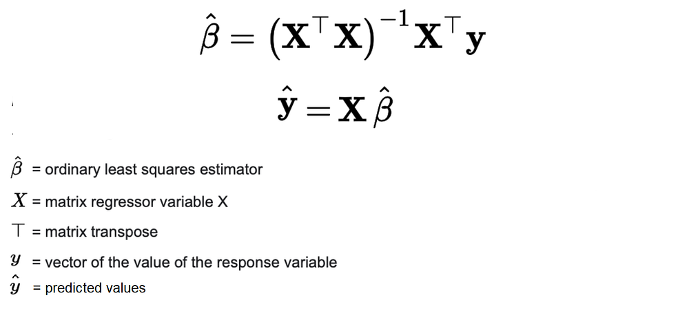
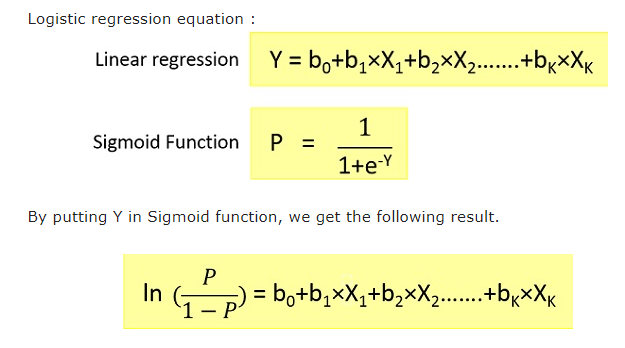

# Sure Tomorrow Insurance Company - Machine Learning Project

## Project Overview

The Sure Tomorrow insurance company tasked us with solving several machine-learning challenges to improve their customer service and data security. This project focuses on:

- Customer Similarity Analysis: Finding customers who are similar to a given customer to assist in targeted marketing.
- Benefit Prediction: Predicting whether a new customer is likely to receive an insurance benefit.
- Benefit Quantity Prediction: Predicting the number of insurance benefits a customer is likely to receive using linear regression.
- Data Obfuscation: Protecting customers' personal data through data masking while ensuring the accuracy of machine learning models.
- The main mathematical challenge was to prove that data obfuscation using an invertible matrix does not affect the performance of a linear regression model.

## Data Description
The dataset is stored in the file insurance_us.csv. It includes:

- Features: Gender, age, salary, and the number of family members.
- Target: Number of insurance benefits received by an insured person over the last five years.

## Project Steps
1. Data Preparation
- Loading and Cleaning: Loaded the data, checked for missing values, and performed basic cleaning.
- Feature Engineering: Created additional features based on the existing ones if necessary.
2. Customer Similarity Analysis
- Method: Used Euclidean distance to find customers with similar profiles.
- Application: The company can now target similar customers with personalized offers.
3. Benefit Prediction
- Method: Built a logistic regression model to predict whether a customer is likely to receive an insurance benefit.
- Evaluation: Compared the logistic regression model to a dummy classifier and confirmed that our model performs significantly better.
4. Benefit Quantity Prediction (Linear Regression)
- Method: Built a linear regression model to predict the number of insurance benefits.
Evaluation: Used Root Mean Squared Error (RMSE) and R² as evaluation metrics.
5. Data Obfuscation

Mathematical Explanation
To protect customers' data, we applied a linear transformation to obfuscate the data:

Matrix Notation: Let X be the original feature matrix, and P be an invertible matrix. The obfuscated feature matrix X' is given by:

𝑋
′
=
𝑋
⋅
𝑃
X 
′
 =X⋅P
Obfuscation: This transformation makes it hard to recover the original data X without knowing the matrix P.

Linear Regression on Obfuscated Data: The weights for the obfuscated data, wp, are calculated as follows:

𝑤
𝑝
=
(
(
𝑋
⋅
𝑃
)
𝑇
⋅
(
𝑋
⋅
𝑃
)
)
−
1
⋅
(
𝑋
⋅
𝑃
)
𝑇
⋅
𝑦
wp=((X⋅P) 
T
 ⋅(X⋅P)) 
−1
 ⋅(X⋅P) 
T
 ⋅y
Simplifying the expression for wp using matrix properties:

𝑤
𝑝
=
𝑃
−
1
⋅
𝑤
wp=P 
−1
 ⋅w
- where w is the weight vector for the original data.

Prediction with Obfuscated Weights: The predicted values y' for the obfuscated data are:

𝑦
′
=
𝑋
⋅
𝑤
y 
′
 =X⋅w

- which shows that the predictions are identical for both the obfuscated and original data.

## Results
RMSE and R² Consistency: Both the original and obfuscated data yield the same RMSE and R² values:

RMSE
=
0.3145
,
𝑅
2
=
0.3626
RMSE=0.3145,R 
2
 =0.3626

- This demonstrates that the obfuscation transformation preserves the quality of the linear regression model.

Predicted Values: The predicted values for both the original and obfuscated data are nearly identical, confirming that the transformation does not alter the model's predictions.

Practical Implications:
- Data Privacy: The obfuscation technique can enhance data privacy by transforming the data in a way that is difficult to interpret without the inverse transformation.
- Model Integrity: The integrity of the linear regression model is maintained, ensuring that analysis or decision-making based on the model remains reliable.

## Conclusion
This project successfully demonstrated that:

- Machine learning models can be used effectively for customer similarity analysis and benefit prediction.
- Data obfuscation using an invertible matrix does not compromise the performance of linear regression models, providing a robust method for protecting sensitive data.
- The mathematical proofs and computational results validate that data privacy can be achieved without sacrificing model accuracy, making this approach practical for real-world applications.

